# GroqTales Enterprise Architecture

## Table of Contents

- [Overview](#overview)
- [System Architecture](#system-architecture)
- [Frontend Architecture](#frontend-architecture)
- [Backend Architecture](#backend-architecture)
- [Blockchain Architecture](#blockchain-architecture)
- [AI Integration Architecture](#ai-integration-architecture)
- [Directory Structure](#directory-structure)
- [System Diagrams](#system-diagrams)
- [Data Flow](#data-flow)
- [Security Architecture](#security-architecture)
- [Deployment Architecture](#deployment-architecture)
- [Performance Architecture](#performance-architecture)
- [Development Workflow](#development-workflow)

## Overview

GroqTales is an enterprise-grade AI-powered Web3 storytelling platform built with modern
technologies and architectural best practices. The system follows a microservices-inspired modular
architecture with clear separation of concerns, enabling scalability, maintainability, and
extensibility.

### Core Technologies

- **Frontend**: Next.js 14 with App Router, React 18, TypeScript
- **Styling**: Tailwind CSS, shadcn/ui components
- **Backend**: Next.js API Routes, Node.js runtime
- **Database**: MongoDB with Mongoose ODM
- **Blockchain**: Monad SDK, Solidity Smart Contracts
- **AI**: Groq API for story generation
- **Deployment**: Vercel with edge runtime optimization

## System Architecture

### High-Level System Overview

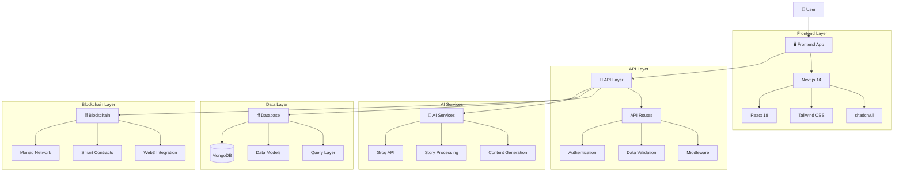
```mermaid
graph TB
    User[👤 User] --> Frontend[🖥️ Frontend App]
    Frontend --> API[🔗 API Layer]
    API --> AI[🤖 AI Services]
    API --> DB[🗄️ Database]
    API --> Blockchain[⛓️ Blockchain]

    subgraph "Frontend Layer"
        Frontend --> NextJS[Next.js 14]
        NextJS --> React[React 18]
        NextJS --> TailwindCSS[Tailwind CSS]
        NextJS --> Components[shadcn/ui]
    end

    subgraph "API Layer"
        API --> Routes[API Routes]
        Routes --> Auth[Authentication]
        Routes --> Validation[Data Validation]
        Routes --> Middleware[Middleware]
    end

    subgraph "AI Services"
        AI --> Groq[Groq API]
        AI --> Processing[Story Processing]
        AI --> Generation[Content Generation]
    end

    subgraph "Data Layer"
        DB --> MongoDB[(MongoDB)]
        DB --> Models[Data Models]
        DB --> Queries[Query Layer]
    end

    subgraph "Blockchain Layer"
        Blockchain --> Monad[Monad Network]
        Blockchain --> Contracts[Smart Contracts]
        Blockchain --> Web3[Web3 Integration]
    end
```

## Frontend Architecture

### Component Architecture

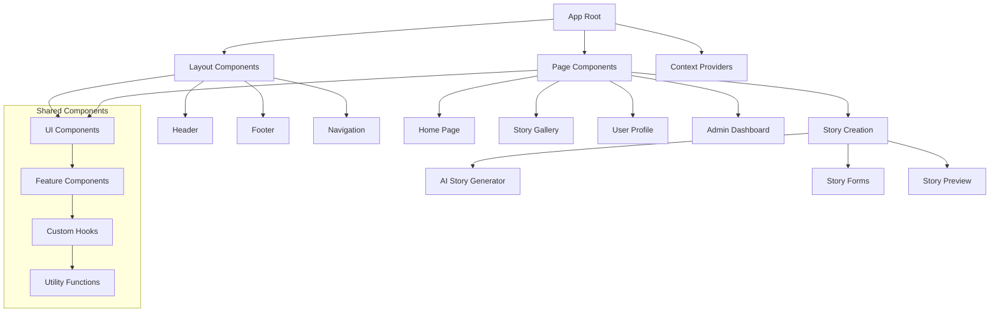
```mermaid
graph TD
    App[App Root] --> Layout[Layout Components]
    App --> Pages[Page Components]
    App --> Providers[Context Providers]

    Layout --> Header[Header]
    Layout --> Footer[Footer]
    Layout --> Navigation[Navigation]

    Pages --> Home[Home Page]
    Pages --> Create[Story Creation]
    Pages --> Gallery[Story Gallery]
    Pages --> Profile[User Profile]
    Pages --> Admin[Admin Dashboard]

    Create --> AIGenerator[AI Story Generator]
    Create --> Forms[Story Forms]
    Create --> Preview[Story Preview]

    subgraph "Shared Components"
        UI[UI Components]
        Features[Feature Components]
        Hooks[Custom Hooks]
        Utils[Utility Functions]
    end

    Pages --> UI
    Layout --> UI
    UI --> Features
    Features --> Hooks
    Hooks --> Utils
```

### State Management Architecture

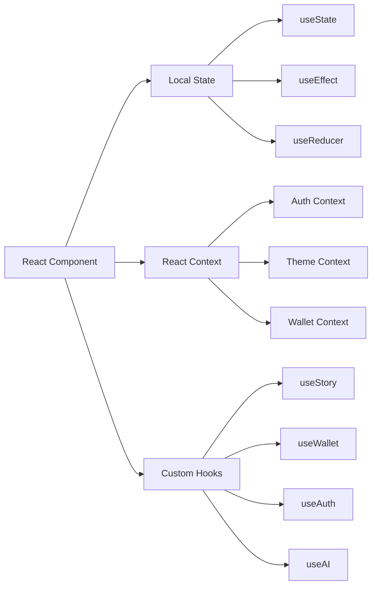
```mermaid
graph LR
    Component[React Component] --> LocalState[Local State]
    Component --> Context[React Context]
    Component --> Hooks[Custom Hooks]

    Context --> AuthContext[Auth Context]
    Context --> ThemeContext[Theme Context]
    Context --> WalletContext[Wallet Context]

    Hooks --> useStory[useStory]
    Hooks --> useWallet[useWallet]
    Hooks --> useAuth[useAuth]
    Hooks --> useAI[useAI]

    LocalState --> useState[useState]
    LocalState --> useEffect[useEffect]
    LocalState --> useReducer[useReducer]
```

## Backend Architecture

### API Architecture

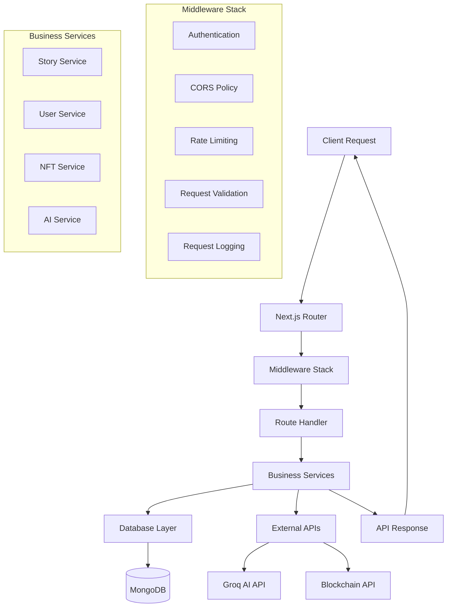
```mermaid
graph TB
    Client[Client Request] --> Router[Next.js Router]
    Router --> Middleware[Middleware Stack]
    Middleware --> Handler[Route Handler]

    subgraph "Middleware Stack"
        Auth[Authentication]
        CORS[CORS Policy]
        RateLimit[Rate Limiting]
        Validation[Request Validation]
        Logging[Request Logging]
    end

    Handler --> Services[Business Services]
    Services --> Database[Database Layer]
    Services --> External[External APIs]

    subgraph "Business Services"
        StoryService[Story Service]
        UserService[User Service]
        NFTService[NFT Service]
        AIService[AI Service]
    end

    Database --> MongoDB[(MongoDB)]
    External --> GroqAPI[Groq AI API]
    External --> BlockchainAPI[Blockchain API]

    Services --> Response[API Response]
    Response --> Client
```

### Data Models Architecture

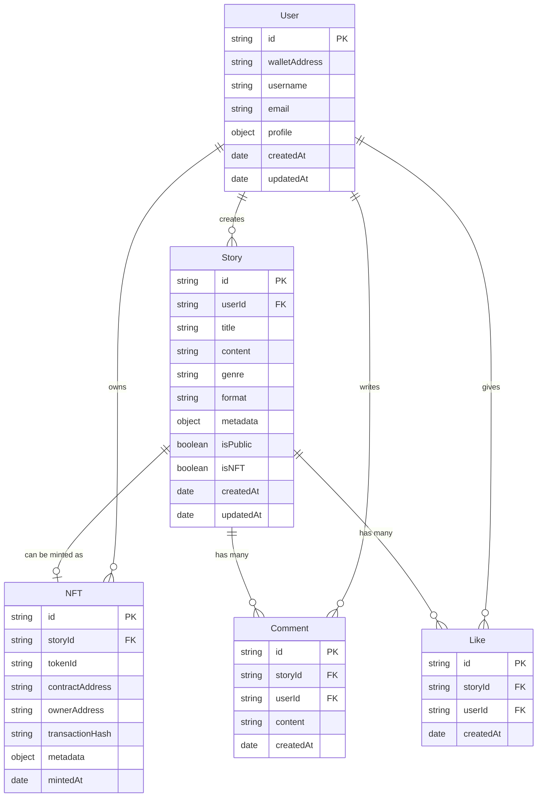
```mermaid
erDiagram
    User {
        string id PK
        string walletAddress
        string username
        string email
        object profile
        date createdAt
        date updatedAt
    }

    Story {
        string id PK
        string userId FK
        string title
        string content
        string genre
        string format
        object metadata
        boolean isPublic
        boolean isNFT
        date createdAt
        date updatedAt
    }

    NFT {
        string id PK
        string storyId FK
        string tokenId
        string contractAddress
        string ownerAddress
        string transactionHash
        object metadata
        date mintedAt
    }

    Comment {
        string id PK
        string storyId FK
        string userId FK
        string content
        date createdAt
    }

    Like {
        string id PK
        string storyId FK
        string userId FK
        date createdAt
    }

    User ||--o{ Story : creates
    Story ||--o| NFT : "can be minted as"
    Story ||--o{ Comment : "has many"
    Story ||--o{ Like : "has many"
    User ||--o{ Comment : writes
    User ||--o{ Like : gives
    User ||--o{ NFT : owns
```

## Blockchain Architecture

### Web3 Integration Flow

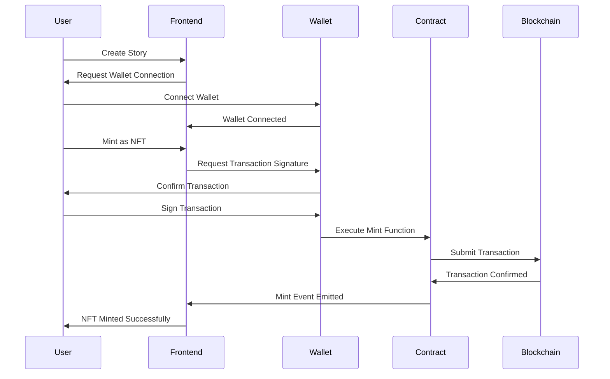
```mermaid
sequenceDiagram
    participant User
    participant Frontend
    participant Wallet
    participant Contract
    participant Blockchain

    User->>Frontend: Create Story
    Frontend->>User: Request Wallet Connection
    User->>Wallet: Connect Wallet
    Wallet->>Frontend: Wallet Connected

    User->>Frontend: Mint as NFT
    Frontend->>Wallet: Request Transaction Signature
    Wallet->>User: Confirm Transaction
    User->>Wallet: Sign Transaction

    Wallet->>Contract: Execute Mint Function
    Contract->>Blockchain: Submit Transaction
    Blockchain->>Contract: Transaction Confirmed
    Contract->>Frontend: Mint Event Emitted
    Frontend->>User: NFT Minted Successfully
```

### Smart Contract Architecture

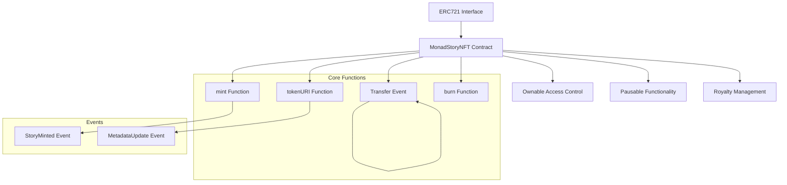
```mermaid
graph TB
    Interface[ERC721 Interface] --> StoryNFT[MonadStoryNFT Contract]
    StoryNFT --> Ownable[Ownable Access Control]
    StoryNFT --> Pausable[Pausable Functionality]
    StoryNFT --> Royalties[Royalty Management]

    subgraph "Core Functions"
        Mint[mint Function]
        Transfer[transfer Functions]
        Metadata[tokenURI Function]
        Burn[burn Function]
    end

    StoryNFT --> Mint
    StoryNFT --> Transfer
    StoryNFT --> Metadata
    StoryNFT --> Burn

    subgraph "Events"
        StoryMinted[StoryMinted Event]
        MetadataUpdate[MetadataUpdate Event]
        Transfer[Transfer Event]
    end

    Mint --> StoryMinted
    Metadata --> MetadataUpdate
    Transfer --> Transfer
```

## AI Integration Architecture

### AI Story Generation Flow

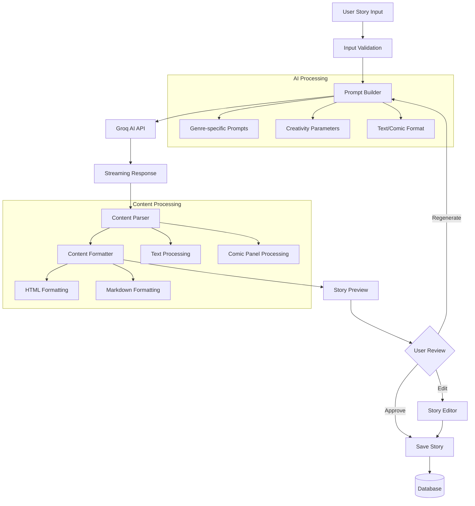
```mermaid
flowchart TD
    UserInput[User Story Input] --> Validation[Input Validation]
    Validation --> PromptBuilder[Prompt Builder]
    PromptBuilder --> GroqAPI[Groq AI API]

    GroqAPI --> Stream[Streaming Response]
    Stream --> Parser[Content Parser]
    Parser --> Formatter[Content Formatter]
    Formatter --> Preview[Story Preview]

    Preview --> UserReview{User Review}
    UserReview -->|Approve| Save[Save Story]
    UserReview -->|Regenerate| PromptBuilder
    UserReview -->|Edit| Editor[Story Editor]

    Save --> Database[(Database)]
    Editor --> Save

    subgraph "AI Processing"
        PromptBuilder --> GenrePrompts[Genre-specific Prompts]
        PromptBuilder --> CreativityLevel[Creativity Parameters]
        PromptBuilder --> ContentType[Text/Comic Format]
    end

    subgraph "Content Processing"
        Parser --> TextProcessor[Text Processing]
        Parser --> ComicProcessor[Comic Panel Processing]
        Formatter --> HTMLFormatter[HTML Formatting]
        Formatter --> MarkdownFormatter[Markdown Formatting]
    end
```

## Directory Structure

### Organized Codebase Structure (v1.1.0)

```
GroqTales/
├── 📁 app/                     # Next.js App Router
│   ├── 📁 api/                 # API routes
│   │   ├── 📁 groq/           # AI generation endpoints
│   │   ├── 📁 monad/          # Blockchain endpoints
│   │   ├── 📁 stories/        # Story CRUD operations
│   │   └── 📁 auth/           # Authentication endpoints
│   ├── 📁 components/         # Page-specific components
│   ├── 📁 (routes)/          # Route groups
│   │   ├── 📁 admin/         # Admin dashboard
│   │   ├── 📁 create/        # Story creation
│   │   ├── 📁 gallery/       # Story gallery
│   │   └── 📁 profile/       # User profiles
│   ├── layout.tsx            # Root layout
│   ├── page.tsx              # Homepage
│   └── globals.css           # Global styles
├── 📁 components/             # Reusable UI components
│   ├── 📁 ui/                # Base UI components (shadcn/ui)
│   ├── 📁 features/          # Feature-specific components
│   ├── 📁 layout/            # Layout components
│   └── 📁 providers/         # React context providers
├── 📁 src/                   # Organized source code (New in v1.1.0)
│   ├── 📁 blockchain/        # Web3 and blockchain utilities
│   │   ├── blockchain_data_fetch.js
│   │   ├── nft_data_fetch.js
│   │   └── clients.ts
│   ├── 📁 ai/               # AI processing and training
│   │   ├── main.py
│   │   ├── train_groq_model.py
│   │   └── requirements.txt
│   ├── 📁 data/             # Datasets and configurations
│   │   ├── 📁 datasets/     # Training datasets by genre
│   │   └── 📁 config/       # Configuration files
│   └── 📁 tools/            # Development and utility scripts
├── 📁 lib/                   # Utility functions and configurations
│   ├── 📁 api/              # API client functions
│   ├── 📁 auth/             # Authentication utilities
│   ├── 📁 blockchain/       # Web3 utilities
│   ├── utils.ts             # General utilities
│   └── constants.ts         # Application constants
├── 📁 types/                # TypeScript definitions
├── 📁 hooks/                # Custom React hooks
├── 📁 contracts/            # Smart contracts
├── 📁 public/               # Static assets
├── 📁 deployment/           # Deployment configurations (New in v1.1.0)
├── 📁 tests/                # Test files
└── 📁 docs/                 # Documentation
```

### Frontend Directory Details

```
/app - Next.js 13+ App Router
├── /api - API routes and endpoints
│   ├── /groq - AI story generation
│   ├── /monad - Blockchain interactions
│   ├── /stories - Story CRUD operations
│   └── /auth - User authentication
├── /globals.css - Global styles
├── /layout.tsx - Root application layout
├── /page.tsx - Homepage
└── /(routes) - Route groups

/components - Reusable UI Components
├── /ui - Base UI components (shadcn/ui)
├── /features - Feature-specific components
├── /layout - Layout-related components
└── /providers - React context providers

/lib - Utilities and Configurations
├── /api - API client functions
├── /auth - Authentication utilities
├── /blockchain - Web3 and blockchain utilities
├── /utils.ts - General utility functions
├── /constants.ts - Application constants
└── /validations.ts - Zod validation schemas

/types - TypeScript Definitions
├── /api.ts - API response types
├── /user.ts - User-related types
├── /story.ts - Story-related types
└── /nft.ts - NFT-related types

/hooks - Custom React Hooks
└── /use-*.ts - Individual hook files

/public - Static Assets
├── /images - Image assets
└── /icons - Icon assets
```

## System Diagrams

### Complete Data Flow Architecture

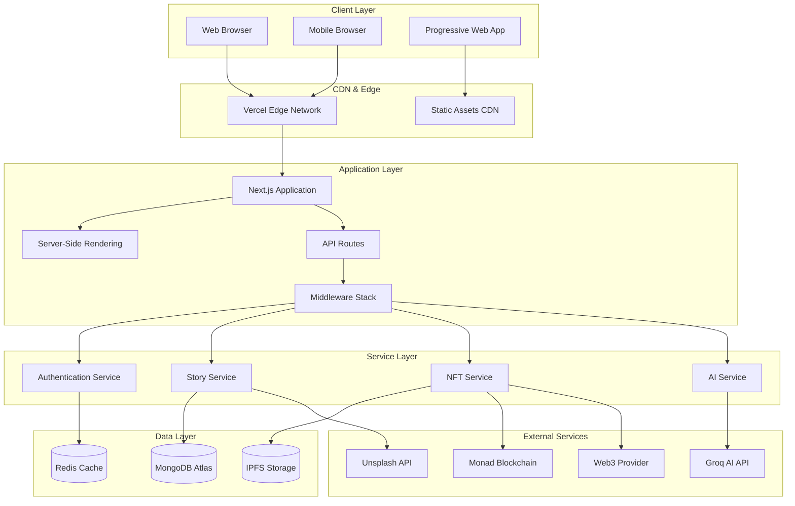
```mermaid
graph TB
    subgraph "Client Layer"
        Browser[Web Browser]
        Mobile[Mobile Browser]
        PWA[Progressive Web App]
    end

    subgraph "CDN & Edge"
        Vercel[Vercel Edge Network]
        CDN[Static Assets CDN]
    end

    subgraph "Application Layer"
        NextJS[Next.js Application]
        SSR[Server-Side Rendering]
        API[API Routes]
        Middleware[Middleware Stack]
    end

    subgraph "Service Layer"
        AuthService[Authentication Service]
        StoryService[Story Service]
        NFTService[NFT Service]
        AIService[AI Service]
    end

    subgraph "Data Layer"
        MongoDB[(MongoDB Atlas)]
        Redis[(Redis Cache)]
        IPFS[(IPFS Storage)]
    end

    subgraph "External Services"
        GroqAI[Groq AI API]
        Monad[Monad Blockchain]
        Unsplash[Unsplash API]
        Web3Provider[Web3 Provider]
    end

    Browser --> Vercel
    Mobile --> Vercel
    PWA --> CDN

    Vercel --> NextJS
    NextJS --> SSR
    NextJS --> API
    API --> Middleware

    Middleware --> AuthService
    Middleware --> StoryService
    Middleware --> NFTService
    Middleware --> AIService

    StoryService --> MongoDB
    AuthService --> Redis
    NFTService --> IPFS

    AIService --> GroqAI
    NFTService --> Monad
    StoryService --> Unsplash
    NFTService --> Web3Provider
```

### User Journey Flow

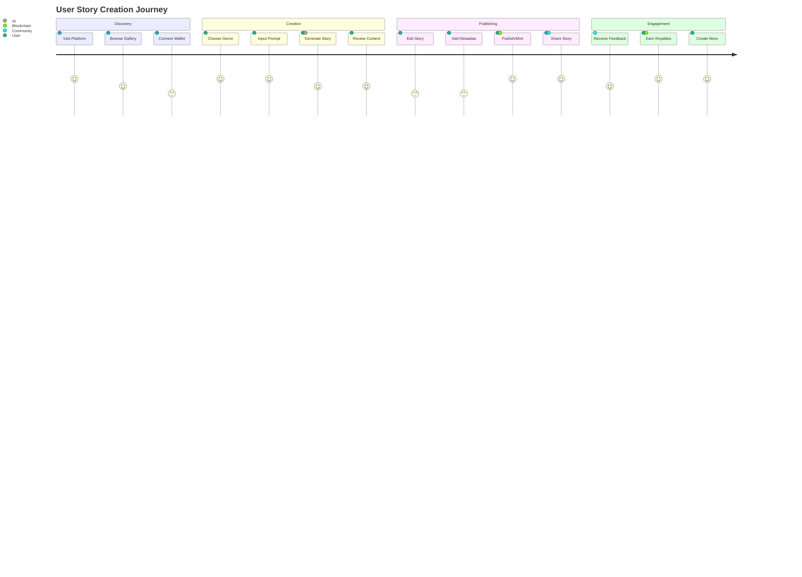
```mermaid
journey
    title User Story Creation Journey
    section Discovery
      Visit Platform: 5: User
      Browse Gallery: 4: User
      Connect Wallet: 3: User
    section Creation
      Choose Genre: 5: User
      Input Prompt: 5: User
      Generate Story: 4: User, AI
      Review Content: 4: User
    section Publishing
      Edit Story: 3: User
      Add Metadata: 3: User
      Publish/Mint: 5: User, Blockchain
      Share Story: 5: User, Community
    section Engagement
      Receive Feedback: 4: Community
      Earn Royalties: 5: User, Blockchain
      Create More: 5: User
```

### Component Interaction Flow

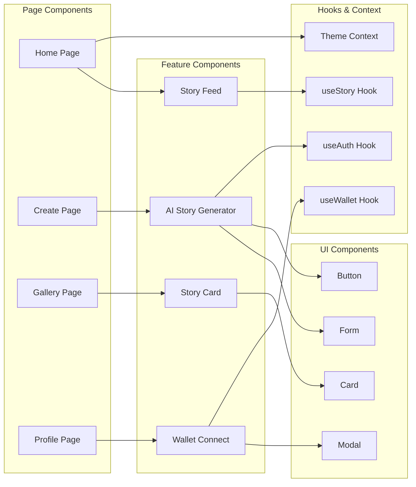
```mermaid
graph LR
    subgraph "Page Components"
        HomePage[Home Page]
        CreatePage[Create Page]
        GalleryPage[Gallery Page]
        ProfilePage[Profile Page]
    end

    subgraph "Feature Components"
        AIGenerator[AI Story Generator]
        StoryCard[Story Card]
        WalletConnect[Wallet Connect]
        StoryFeed[Story Feed]
    end

    subgraph "UI Components"
        Button[Button]
        Modal[Modal]
        Form[Form]
        Card[Card]
    end

    subgraph "Hooks & Context"
        useAuth[useAuth Hook]
        useWallet[useWallet Hook]
        useStory[useStory Hook]
        ThemeContext[Theme Context]
    end

    HomePage --> StoryFeed
    CreatePage --> AIGenerator
    GalleryPage --> StoryCard
    ProfilePage --> WalletConnect

    AIGenerator --> Form
    AIGenerator --> Button
    StoryCard --> Card
    WalletConnect --> Modal

    AIGenerator --> useAuth
    WalletConnect --> useWallet
    StoryFeed --> useStory
    HomePage --> ThemeContext
```

## Data Flow

### Story Creation Data Flow

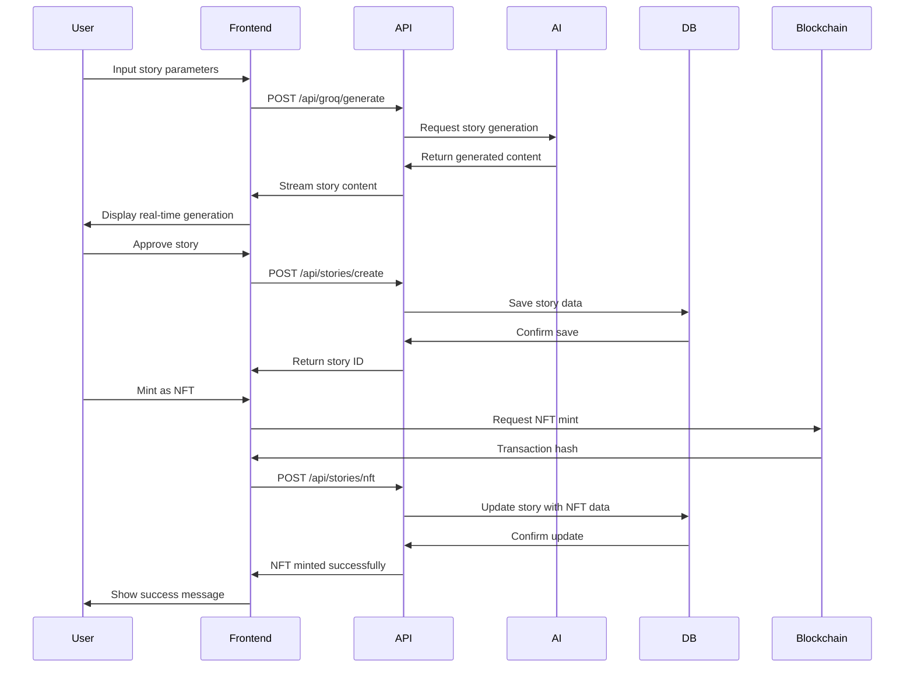
```mermaid
sequenceDiagram
    participant User
    participant Frontend
    participant API
    participant AI
    participant DB
    participant Blockchain

    User->>Frontend: Input story parameters
    Frontend->>API: POST /api/groq/generate
    API->>AI: Request story generation
    AI->>API: Return generated content
    API->>Frontend: Stream story content
    Frontend->>User: Display real-time generation

    User->>Frontend: Approve story
    Frontend->>API: POST /api/stories/create
    API->>DB: Save story data
    DB->>API: Confirm save
    API->>Frontend: Return story ID

    User->>Frontend: Mint as NFT
    Frontend->>Blockchain: Request NFT mint
    Blockchain->>Frontend: Transaction hash
    Frontend->>API: POST /api/stories/nft
    API->>DB: Update story with NFT data
    DB->>API: Confirm update
    API->>Frontend: NFT minted successfully
    Frontend->>User: Show success message
```

### Authentication Flow

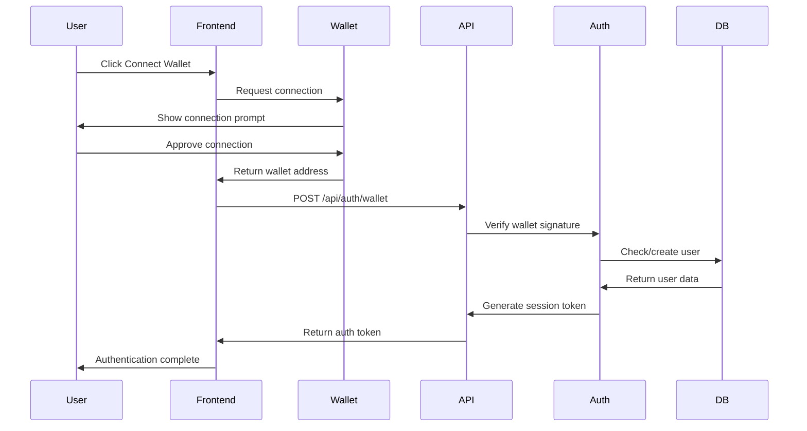
```mermaid
sequenceDiagram
    participant User
    participant Frontend
    participant Wallet
    participant API
    participant Auth
    participant DB

    User->>Frontend: Click Connect Wallet
    Frontend->>Wallet: Request connection
    Wallet->>User: Show connection prompt
    User->>Wallet: Approve connection
    Wallet->>Frontend: Return wallet address

    Frontend->>API: POST /api/auth/wallet
    API->>Auth: Verify wallet signature
    Auth->>DB: Check/create user
    DB->>Auth: Return user data
    Auth->>API: Generate session token
    API->>Frontend: Return auth token
    Frontend->>User: Authentication complete
```

## Security Architecture

### Security Layers


```mermaid
graph TB
    subgraph "Client Security"
        CSP[Content Security Policy]
        HTTPS[HTTPS Enforcement]
        CORS[CORS Protection]
        XSS[XSS Prevention]
    end

    subgraph "Application Security"
        Auth[Authentication]
        AuthZ[Authorization]
        RateLimit[Rate Limiting]
        InputValid[Input Validation]
    end

    subgraph "API Security"
        JWT[JWT Tokens]
        CSRF[CSRF Protection]
        APIKeys[API Key Management]
        Encryption[Data Encryption]
    end

    subgraph "Infrastructure Security"
        WAF[Web Application Firewall]
        DDoS[DDoS Protection]
        SSL[SSL/TLS]
        Monitoring[Security Monitoring]
    end

    subgraph "Blockchain Security"
        SmartContract[Smart Contract Audits]
        WalletSec[Wallet Security]
        TxValid[Transaction Validation]
        MultiSig[Multi-signature]
    end

    Client --> CSP
    Client --> HTTPS
    Client --> CORS
    Client --> XSS

    Application --> Auth
    Application --> AuthZ
    Application --> RateLimit
    Application --> InputValid

    API --> JWT
    API --> CSRF
    API --> APIKeys
    API --> Encryption

    Infrastructure --> WAF
    Infrastructure --> DDoS
    Infrastructure --> SSL
    Infrastructure --> Monitoring

    Blockchain --> SmartContract
    Blockchain --> WalletSec
    Blockchain --> TxValid
    Blockchain --> MultiSig
```

## Deployment Architecture

### Production Deployment Flow

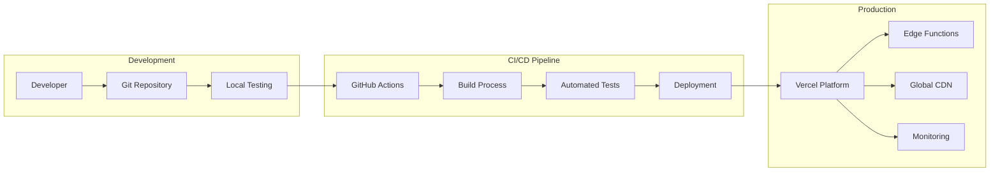
```mermaid
graph LR
    subgraph "Development"
        Dev[Developer]
        Git[Git Repository]
        LocalTest[Local Testing]
    end

    subgraph "CI/CD Pipeline"
        GitHub[GitHub Actions]
        Build[Build Process]
        Test[Automated Tests]
        Deploy[Deployment]
    end

    subgraph "Production"
        Vercel[Vercel Platform]
        Edge[Edge Functions]
        CDN[Global CDN]
        Monitor[Monitoring]
    end

    Dev --> Git
    Git --> LocalTest
    LocalTest --> GitHub

    GitHub --> Build
    Build --> Test
    Test --> Deploy

    Deploy --> Vercel
    Vercel --> Edge
    Vercel --> CDN
    Vercel --> Monitor
```

### Environment Architecture

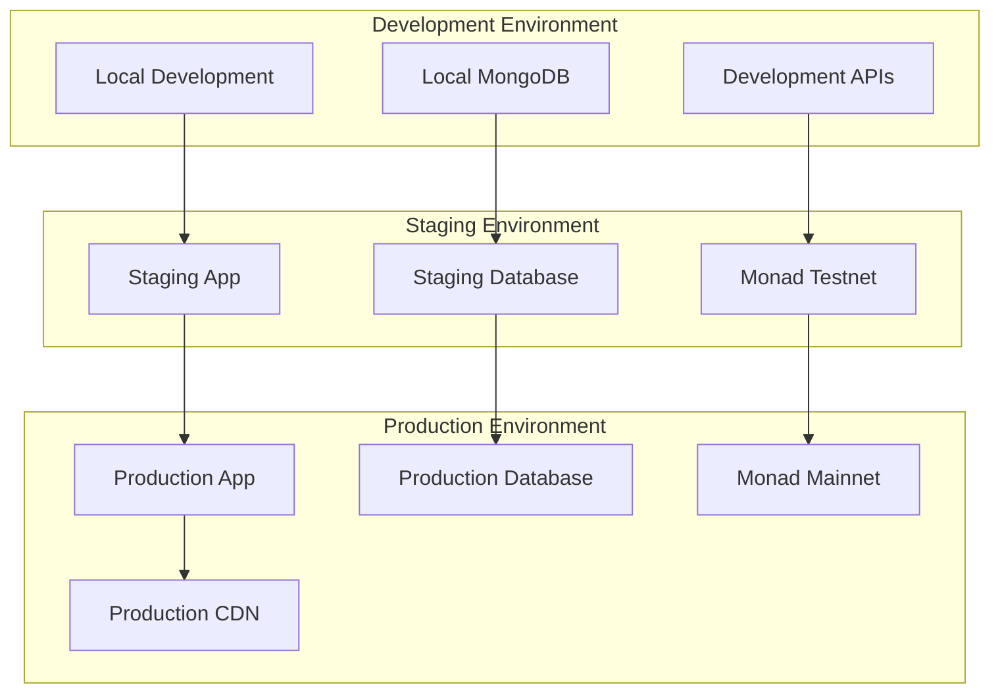
```mermaid
graph TB
    subgraph "Development Environment"
        DevLocal[Local Development]
        DevDB[Local MongoDB]
        DevAPI[Development APIs]
    end

    subgraph "Staging Environment"
        StagingApp[Staging App]
        StagingDB[Staging Database]
        TestNet[Monad Testnet]
    end

    subgraph "Production Environment"
        ProdApp[Production App]
        ProdDB[Production Database]
        MainNet[Monad Mainnet]
        ProdCDN[Production CDN]
    end

    DevLocal --> StagingApp
    StagingApp --> ProdApp

    DevDB --> StagingDB
    StagingDB --> ProdDB

    DevAPI --> TestNet
    TestNet --> MainNet

    ProdApp --> ProdCDN
```

## Performance Architecture

### Caching Strategy

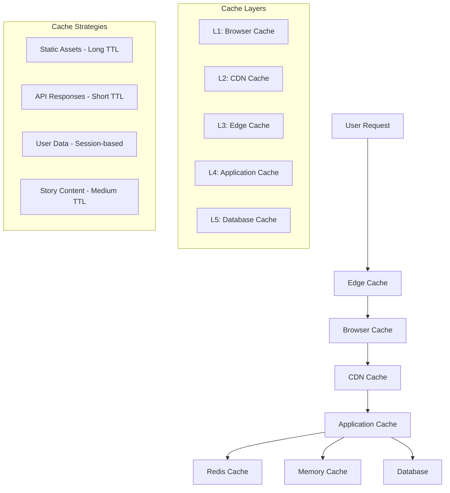
```mermaid
graph TB
    User[User Request] --> EdgeCache[Edge Cache]
    EdgeCache --> BrowserCache[Browser Cache]
    BrowserCache --> CDN[CDN Cache]
    CDN --> AppCache[Application Cache]

    AppCache --> Redis[Redis Cache]
    AppCache --> Memory[Memory Cache]
    AppCache --> Database[Database]

    subgraph "Cache Layers"
        L1[L1: Browser Cache]
        L2[L2: CDN Cache]
        L3[L3: Edge Cache]
        L4[L4: Application Cache]
        L5[L5: Database Cache]
    end

    subgraph "Cache Strategies"
        StaticAssets[Static Assets - Long TTL]
        APIResponses[API Responses - Short TTL]
        UserData[User Data - Session-based]
        StoryContent[Story Content - Medium TTL]
    end
```

### Performance Optimization Flow

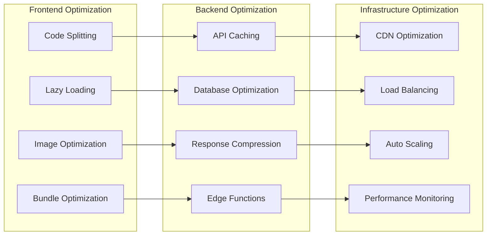
```mermaid
graph LR
    subgraph "Frontend Optimization"
        CodeSplit[Code Splitting]
        LazyLoad[Lazy Loading]
        ImageOpt[Image Optimization]
        Bundle[Bundle Optimization]
    end

    subgraph "Backend Optimization"
        APICache[API Caching]
        DBQuery[Database Optimization]
        Compression[Response Compression]
        EdgeFunc[Edge Functions]
    end

    subgraph "Infrastructure Optimization"
        CDNOpt[CDN Optimization]
        LoadBalance[Load Balancing]
        AutoScale[Auto Scaling]
        Monitor[Performance Monitoring]
    end

    CodeSplit --> APICache
    LazyLoad --> DBQuery
    ImageOpt --> Compression
    Bundle --> EdgeFunc

    APICache --> CDNOpt
    DBQuery --> LoadBalance
    Compression --> AutoScale
    EdgeFunc --> Monitor
```

## Development Workflow

### Git Flow Architecture

```mermaid
gitgraph:
    options:
    {
        "theme": "forest",
        "themeVariables": {
            "fontSize": "12px"
        }
    }
    commit id: "Initial"
    branch develop
    checkout develop
    commit id: "Setup"
    branch feature/ai-integration
    checkout feature/ai-integration
    commit id: "Add Groq API"
    commit id: "Story Generation"
    checkout develop
    merge feature/ai-integration
    branch feature/nft-minting
    checkout feature/nft-minting
    commit id: "Smart Contracts"
    commit id: "Web3 Integration"
    checkout develop
    merge feature/nft-minting
    checkout main
    merge develop
    commit id: "Release v1.1.0"
```

### Code Review Process

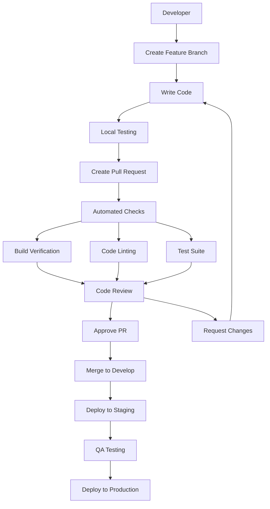
```mermaid
flowchart TD
    Developer[Developer] --> Feature[Create Feature Branch]
    Feature --> Code[Write Code]
    Code --> Test[Local Testing]
    Test --> PR[Create Pull Request]

    PR --> AutoCheck[Automated Checks]
    AutoCheck --> Build[Build Verification]
    AutoCheck --> Lint[Code Linting]
    AutoCheck --> Tests[Test Suite]

    Build --> Review[Code Review]
    Lint --> Review
    Tests --> Review

    Review --> Approve[Approve PR]
    Review --> Changes[Request Changes]
    Changes --> Code

    Approve --> Merge[Merge to Develop]
    Merge --> Deploy[Deploy to Staging]
    Deploy --> QA[QA Testing]
    QA --> Production[Deploy to Production]
```

## Architecture Principles

1. **Separation of Concerns** - Clear separation between UI, business logic, and data
2. **Component Composition** - Reusable, composable components
3. **Type Safety** - Comprehensive TypeScript coverage
4. **Performance** - Optimized loading and rendering with SSR/SSG
5. **Maintainability** - Clean, documented, and testable code
6. **Scalability** - Modular architecture supporting horizontal scaling
7. **Security** - Security-first approach with multiple protection layers
8. **User Experience** - Responsive, accessible, and intuitive interface
9. **Developer Experience** - Clear conventions and development workflow
10. **Observability** - Comprehensive monitoring and logging

---

_Last Updated: January 2, 2025_ _Version: 1.1.0_ _For more detailed information, visit our
[GitHub Wiki](https://github.com/Drago-03/GroqTales/wiki)_
