# GroqTales Enterprise Architecture

## Table of Contents

- [Overview](#overview)
- [System Architecture](#system-architecture)
- [Frontend Architecture](#frontend-architecture)
- [Backend Architecture](#backend-architecture)
- [Blockchain Architecture](#blockchain-architecture)
- [AI Integration Architecture](#ai-integration-architecture)
- [Directory Structure](#directory-structure)
- [System Diagrams](#system-diagrams)
- [Data Flow](#data-flow)
- [Security Architecture](#security-architecture)
- [Deployment Architecture](#deployment-architecture)
- [Performance Architecture](#performance-architecture)
- [Development Workflow](#development-workflow)

## Overview

GroqTales is an enterprise-grade AI-powered Web3 storytelling platform built with modern
technologies and architectural best practices. The system follows a microservices-inspired modular
architecture with clear separation of concerns, enabling scalability, maintainability, and
extensibility.

### Core Technologies

- **Frontend**: Next.js 14 with App Router, React 18, TypeScript
- **Styling**: Tailwind CSS, shadcn/ui components
- **Backend**: Next.js API Routes, Node.js runtime
- **Database**: MongoDB with Mongoose ODM
- **Blockchain**: Monad SDK, Solidity Smart Contracts
- **AI**: Groq API for story generation
- **Deployment**: Vercel with edge runtime optimization

## System Architecture

### High-Level System Overview

```mermaid
graph TB
    User[👤 User] --> Frontend[🖥️ Frontend App]
    Frontend --> API[🔗 API Layer]
    API --> AI[🤖 AI Services]
    API --> DB[🗄️ Database]
    API --> Blockchain[⛓️ Blockchain]

    subgraph "Frontend Layer"
        Frontend --> NextJS[Next.js 14]
        NextJS --> React[React 18]
        NextJS --> TailwindCSS[Tailwind CSS]
        NextJS --> Components[shadcn/ui]
    end

    subgraph "API Layer"
        API --> Routes[API Routes]
        Routes --> Auth[Authentication]
        Routes --> Validation[Data Validation]
        Routes --> Middleware[Middleware]
    end

    subgraph "AI Services"
        AI --> Groq[Groq API]
        AI --> Processing[Story Processing]
        AI --> Generation[Content Generation]
    end

    subgraph "Data Layer"
        DB --> MongoDB[(MongoDB)]
        DB --> Models[Data Models]
        DB --> Queries[Query Layer]
    end

    subgraph "Blockchain Layer"
        Blockchain --> Monad[Monad Network]
        Blockchain --> Contracts[Smart Contracts]
        Blockchain --> Web3[Web3 Integration]
    end
```



## Frontend Architecture

### Component Architecture


### State Management Architecture


## Backend Architecture

### API Architecture


### Data Models Architecture


## Blockchain Architecture

### Web3 Integration Flow


### Smart Contract Architecture


## AI Integration Architecture

### AI Story Generation Flow


## Directory Structure

### Organized Codebase Structure (v1.1.0)

```
GroqTales/
├── 📁 app/                     # Next.js App Router
│   ├── 📁 api/                 # API routes
│   │   ├── 📁 groq/           # AI generation endpoints
│   │   ├── 📁 monad/          # Blockchain endpoints
│   │   ├── 📁 stories/        # Story CRUD operations
│   │   └── 📁 auth/           # Authentication endpoints
│   ├── 📁 components/         # Page-specific components
│   ├── 📁 (routes)/          # Route groups
│   │   ├── 📁 admin/         # Admin dashboard
│   │   ├── 📁 create/        # Story creation
│   │   ├── 📁 gallery/       # Story gallery
│   │   └── 📁 profile/       # User profiles
│   ├── layout.tsx            # Root layout
│   ├── page.tsx              # Homepage
│   └── globals.css           # Global styles
├── 📁 components/             # Reusable UI components
│   ├── 📁 ui/                # Base UI components (shadcn/ui)
│   ├── 📁 features/          # Feature-specific components
│   ├── 📁 layout/            # Layout components
│   └── 📁 providers/         # React context providers
├── 📁 src/                   # Organized source code (New in v1.1.0)
│   ├── 📁 blockchain/        # Web3 and blockchain utilities
│   │   ├── blockchain_data_fetch.js
│   │   ├── nft_data_fetch.js
│   │   └── clients.ts
│   ├── 📁 ai/               # AI processing and training
│   │   ├── main.py
│   │   ├── train_groq_model.py
│   │   └── requirements.txt
│   ├── 📁 data/             # Datasets and configurations
│   │   ├── 📁 datasets/     # Training datasets by genre
│   │   └── 📁 config/       # Configuration files
│   └── 📁 tools/            # Development and utility scripts
├── 📁 lib/                   # Utility functions and configurations
│   ├── 📁 api/              # API client functions
│   ├── 📁 auth/             # Authentication utilities
│   ├── 📁 blockchain/       # Web3 utilities
│   ├── utils.ts             # General utilities
│   └── constants.ts         # Application constants
├── 📁 types/                # TypeScript definitions
├── 📁 hooks/                # Custom React hooks
├── 📁 contracts/            # Smart contracts
├── 📁 public/               # Static assets
├── 📁 deployment/           # Deployment configurations (New in v1.1.0)
├── 📁 tests/                # Test files
└── 📁 docs/                 # Documentation
```

### Frontend Directory Details

```
/app - Next.js 13+ App Router
├── /api - API routes and endpoints
│   ├── /groq - AI story generation
│   ├── /monad - Blockchain interactions
│   ├── /stories - Story CRUD operations
│   └── /auth - User authentication
├── /globals.css - Global styles
├── /layout.tsx - Root application layout
├── /page.tsx - Homepage
└── /(routes) - Route groups

/components - Reusable UI Components
├── /ui - Base UI components (shadcn/ui)
├── /features - Feature-specific components
├── /layout - Layout-related components
└── /providers - React context providers

/lib - Utilities and Configurations
├── /api - API client functions
├── /auth - Authentication utilities
├── /blockchain - Web3 and blockchain utilities
├── /utils.ts - General utility functions
├── /constants.ts - Application constants
└── /validations.ts - Zod validation schemas

/types - TypeScript Definitions
├── /api.ts - API response types
├── /user.ts - User-related types
├── /story.ts - Story-related types
└── /nft.ts - NFT-related types

/hooks - Custom React Hooks
└── /use-*.ts - Individual hook files

/public - Static Assets
├── /images - Image assets
└── /icons - Icon assets
```

## System Diagrams

### Complete Data Flow Architecture


### User Journey Flow


### Component Interaction Flow


## Data Flow

### Story Creation Data Flow


### Authentication Flow


## Security Architecture

### Security Layers


## Deployment Architecture

### Production Deployment Flow


### Environment Architecture


## Performance Architecture

### Caching Strategy


### Performance Optimization Flow


## Development Workflow

### Git Flow Architecture

```mermaid
gitgraph:
    options:
    {
        "theme": "forest",
        "themeVariables": {
            "fontSize": "12px"
        }
    }
    commit id: "Initial"
    branch develop
    checkout develop
    commit id: "Setup"
    branch feature/ai-integration
    checkout feature/ai-integration
    commit id: "Add Groq API"
    commit id: "Story Generation"
    checkout develop
    merge feature/ai-integration
    branch feature/nft-minting
    checkout feature/nft-minting
    commit id: "Smart Contracts"
    commit id: "Web3 Integration"
    checkout develop
    merge feature/nft-minting
    checkout main
    merge develop
    commit id: "Release v1.1.0"
```

### Code Review Process


## Architecture Principles

1. **Separation of Concerns** - Clear separation between UI, business logic, and data
2. **Component Composition** - Reusable, composable components
3. **Type Safety** - Comprehensive TypeScript coverage
4. **Performance** - Optimized loading and rendering with SSR/SSG
5. **Maintainability** - Clean, documented, and testable code
6. **Scalability** - Modular architecture supporting horizontal scaling
7. **Security** - Security-first approach with multiple protection layers
8. **User Experience** - Responsive, accessible, and intuitive interface
9. **Developer Experience** - Clear conventions and development workflow
10. **Observability** - Comprehensive monitoring and logging

---

_Last Updated: January 2, 2025_ _Version: 1.1.0_ _For more detailed information, visit our
[GitHub Wiki](https://github.com/Drago-03/GroqTales/wiki)_
